# Fastgo Scooty - iOS Mobile App 🛴

**Fastgo Scooty** is a modern, eco-friendly electric scooter rental application built with **SwiftUI** and powered by **Supabase**. This project implements the UI/UX design concept by [Orbix Studio on Behance](https://www.behance.net/gallery/186219777/Fastgo-Scooty-UI-UX-Mobile-App-Orbix-Studio), focusing on a seamless user experience for urban mobility. 

---
## 📱 Features

Based on the Fastgo Scooty design specifications, the app includes:

| Feature | Status | Description |
|---------|--------|-------------|
| Phone OTP Authentication | ✅ | Sign in with phone number + SMS OTP via Supabase |
| Onboarding Flow | ✅ | 3-page intro screens for new users |
| User Profile Management | ✅ | Name, gender, DOB, profile picture upload |
| Interactive Map | ✅ | MapKit integration with real-time location |
| Scooter Discovery | ✅ | View nearby available scooters on map |
| Scooter Details Sheet | ✅ | Battery, range, pricing info in bottom sheet |
| Navigation to Scooter | ✅ | Route polyline with ETA & distance |
| QR Code Scanner | ✅ | Camera-based QR scanning to unlock scooter |
| Ride Reservation | ✅ | 10-minute free reservation with countdown timer |
| Ride In-Progress | ✅ | Live ride tracking with parking spots displayed |
| Parking Navigation | ✅ | Navigate to designated parking areas |
| Ride Completion | ✅ | Finish ride flow with instructions |
| Ride History | ✅ | View past rides and trip details |
| Promo Codes | ✅ | Apply promotional discounts |
| Photo Verification | ✅ | Submit a photo of your parked scooter for completing ride |

### 🚧 Pending Features
- **Payment Integration** - Coming soon

---

## 🛠 Tech Stack

* **Language**: Swift 5+
* **Framework**: SwiftUI
* **Architecture**: MVVM (Model-View-ViewModel)
* **Backend**: Supabase (PostgreSQL, Phone Auth, Realtime, Storage), Twilio (OTP SMS)
* **Maps**: MapKit / CoreLocation
* **Hardware Integration**: AVFoundation (QR Scanning)

---
## 📂 Project Structure

```
Fastgo/
├── FastgoApp.swift              # App entry point & RootView
├── Model/
│   ├── User.swift               # User profile models (UserProfile, UserStatus)
│   ├── Scooter.swift            # Scooter & ScooterDTO models
│   ├── ScooterAnnotation.swift  # Map annotation for scooters
│   ├── ParkingAnnotation.swift  # Map annotation for parking spots
│   ├── Ride.swift               # Ride model & RideStatus enum
│   ├── OnboardingPage.swift     # Onboarding page content
│   ├── Promo.swift              # Promo variants & data
│   ├── FinishRide.swift         # Finish ride instructions data
│   ├── ProfileOptions.swift     # Profile menu options
│   └── Country.swift            # Country picker data
│
├── View/
│   ├── Onboarding/              # Welcome/intro screens (3 pages)
│   │   ├── View/
│   │   └── ViewModel/
│   │
│   ├── SignIn/                  # Authentication flow
│   │   ├── View/                # SignInView, OTPView
│   │   └── ViewModel/
│   │
│   ├── BasicInfo/               # Profile setup after first login
│   │   ├── View/                # Name, Gender, DOB inputs
│   │   └── ViewModel/
│   │
│   ├── Home/                    # Main map screen
│   │   ├── View/                # HomeView, CustomAppBar, LocationButton
│   │   └── ViewModel/
│   │
│   ├── Map/                     # Map display
│   │   ├── View/                # MapView
│   │   └── ViewModel/           # MapViewModel (camera, location, geocoding)
│   │
│   ├── RideDetails/             # Scooter detail bottom sheet
│   │   ├── View/                # RideDetailsView, ScooterRideActionFeatures
│   │   └── ViewModel/
│   │
│   ├── RideNavigation/          # Navigation & ride flow
│   │   ├── View/                # RideNavigationView, CancellationRideCard,
│   │   │                        # InProgressRideCard, RideStateBottomCard,
│   │   │                        # SlideToAction, AnnotationInfoCapsule
│   │   └── ViewModel/           # RideNavigationViewModel (ride state, routes)
│   │
│   ├── QRCodeScanner/           # QR code scanning
│   │   ├── View/                # QRCodeScanView
│   │   ├── Controller/          # QRScannerController (AVFoundation)
│   │   └── ViewModel/
│   │
│   ├── FinishRide/              # Ride completion screen
│   │   └── View/                # FinishRideView, FinishRideCard
│   │
│   └── Profile/                 # User profile screens
│       ├── View/                # ProfileView
│       ├── SubViews/            # MyAccountView, RideHistoryView, etc.
│       ├── Components/          # Profile UI components
│       └── ViewModel/
│
├── Components/                  # Reusable UI components
│   ├── ScooterAnnotationContent.swift    # Scooter map marker
│   ├── ParkingAnnotationView.swift       # Parking map marker
│   ├── UserLocationAnnotation.swift      # Custom user location marker
│   ├── CustomGreenButton.swift           # Primary action button
│   ├── CustomToolBarBackButton.swift     # Navigation back button
│   ├── LottieAnimation.swift             # Lottie animation wrapper
│   └── [Other reusable components]
│
├── Services/
│   ├── SupabaseService.swift    # Auth, storage, session management
│   ├── UserService.swift        # User CRUD operations
│   ├── NavigationServices.swift # Fetch scooters & parking
│   └── RideService.swift        # Ride operations
│
├── Utils/
│   ├── Manager/
│   │   ├── AppStateManager.swift   # Global app state & flow control
│   │   ├── LocationManager.swift   # CLLocationManager wrapper
│   │   └── CacheManager.swift      # Local caching (user, images)
│   ├── Extensions/              # Swift extensions
│   └── Helpers/                 # Utility helpers
│
├── Routes/
│   └── Router.swift             # HomeRouter, HomeRoutes, ProfileOptionRoutes
│
├── Constants/
│   ├── APIConstants.swift       # Supabase URL & API key
│   ├── AppConstants.swift       # Asset names, colors
│   └── CountryConstants.swift   # Country codes for phone input
│
└── Resources/
    └── Assets.xcassets          # Images, colors, app icon
```

---


## 🚀 Getting Started

### Prerequisites

* **Xcode**: Version 15.0 or later
* **iOS**: Target iOS 17.0+
* **Supabase Account**: A generic project created on [Supabase](https://supabase.com/)
* **Twilio Account**: A generic project created on [Twilio](https://www.twilio.com/en-us/messaging/channels/sms)

### Installation

1.  **Clone the repository**
    ```bash
    git clone https://github.com/vishwas-kr/Fastgo.git
    cd fastgo
    ```

2.  **Open in Xcode**
    Open `FastgoScooty.xcodeproj` in Xcode.

3.  **Configure Environment Variables**
    Create a file named `Secrets.plist` (or use a `.xcconfig` file) in your project root to store your API keys. 
    
    ```xml
    <?xml version="1.0" encoding="UTF-8"?>
    <!DOCTYPE plist PUBLIC "-//Apple//DTD PLIST 1.0//EN" "[http://www.apple.com/DTDs/PropertyList-1.0.dtd](http://www.apple.com/DTDs/PropertyList-1.0.dtd)">
    <plist version="1.0">
    <dict>
        <key>SupabaseURL</key>
        <string>YOUR_SUPABASE_PROJECT_URL</string>
        <key>SupabaseAnonKey</key>
        <string>YOUR_SUPABASE_ANON_KEY</string>
    </dict>
    </plist>
    ```
## Supabase Database Setup
* ##### Run this SQL in the Supabase SQL Editor for creating a table Users:

```
CREATE TABLE users (
    id UUID PRIMARY KEY REFERENCES auth.users(id) ON DELETE CASCADE,
    phone VARCHAR(20) UNIQUE NOT NULL,
    name VARCHAR(100),
    gender VARCHAR(20),
    about_me VARCHAR(100),
    date_of_birth DATE,
    profile_image TEXT,
    total_rides INTEGER NOT NULL DEFAULT 0,
    total_distance DECIMAL(10,2) NOT NULL DEFAULT 0.0,
    user_status JSONB NOT NULL DEFAULT '{"basic_info_completed": false}'::jsonb,
    created_at TIMESTAMP WITH TIME ZONE NOT NULL DEFAULT NOW(),
    updated_at TIMESTAMP WITH TIME ZONE NOT NULL DEFAULT NOW()
);
```

* ##### For Adding RLS Policy for Users Table:


```
ALTER TABLE users ENABLE ROW LEVEL SECURITY;

CREATE POLICY "Users can read their own profile"
ON users
FOR SELECT
USING (auth.uid() = id);

CREATE POLICY "Users can insert their own profile"
ON users
FOR INSERT
WITH CHECK (auth.uid() = id);

CREATE POLICY "Users can update their own profile"
ON users
FOR UPDATE
USING (auth.uid() = id)
WITH CHECK (auth.uid() = id);

CREATE POLICY "Users can delete their own profile"
ON users
FOR DELETE
USING (auth.uid() = id);
```

* ##### Run this SQL in the Supabase SQL Editor for creating a table Rides:

```
CREATE TYPE ride_status AS ENUM (
    'reserved',
    'in_progress',
    'completed',
    'cancelled'
);

CREATE TABLE rides (
    id UUID PRIMARY KEY DEFAULT gen_random_uuid(),

    user_id UUID NOT NULL
        REFERENCES users(id)
        ON DELETE CASCADE,

    scooter_id UUID NOT NULL
        REFERENCES scooters(id),

    status ride_status NOT NULL DEFAULT 'reserved',

    -- Start
    start_latitude DOUBLE PRECISION NOT NULL,
    start_longitude DOUBLE PRECISION NOT NULL,
    start_location_name TEXT,

    started_at TIMESTAMPTZ,

    -- End (nullable until ride finishes)
    end_latitude DOUBLE PRECISION,
    end_longitude DOUBLE PRECISION,
    end_location_name TEXT,

    ended_at TIMESTAMPTZ,

    -- Metrics
    duration_minutes INT CHECK (duration_minutes >= 0),
    distance_km DECIMAL(10,2) CHECK (distance_km >= 0),

    -- Billing
    base_fare DECIMAL(10,2) NOT NULL DEFAULT 0,
    time_fare DECIMAL(10,2) NOT NULL DEFAULT 0,
    total_fare DECIMAL(10,2) NOT NULL DEFAULT 0,

    promo_code TEXT,
    discount_amount DECIMAL(10,2) DEFAULT 0,

    ride_completed_photo_url TEXT NULL;

    created_at TIMESTAMPTZ NOT NULL DEFAULT NOW()
);
```
* ##### For Adding RLS Policy for Rides Table:


```
CREATE POLICY "Users can view their rides"
ON rides
FOR SELECT
USING (user_id = auth.uid());


CREATE POLICY "Users can create rides"
ON rides
FOR INSERT
WITH CHECK (user_id = auth.uid());


CREATE POLICY "Users can update active rides"
ON rides
FOR UPDATE
USING (
    user_id = auth.uid()
    AND status IN ('reserved', 'in_progress')
)
WITH CHECK (
    user_id = auth.uid()
);
```

* ##### Run this SQL in the Supabase SQL Editor for creating a table Scooters:

```
CREATE TABLE scooters (
    id UUID PRIMARY KEY DEFAULT gen_random_uuid(),

    unique_code VARCHAR(50) UNIQUE NOT NULL, -- QR code value
    type scooter_type NOT NULL,

    battery INTEGER NOT NULL CHECK (battery BETWEEN 0 AND 100),
    range_km INTEGER NOT NULL CHECK (range_km >= 0),

    per_min_cost DECIMAL(10,2) NOT NULL,
    image_name TEXT NOT NULL,

    latitude DOUBLE PRECISION NOT NULL,
    longitude DOUBLE PRECISION NOT NULL,

    status scooter_status NOT NULL DEFAULT 'available',

    last_seen_at TIMESTAMPTZ NOT NULL DEFAULT NOW(),
    created_at TIMESTAMPTZ NOT NULL DEFAULT NOW()
);
```

* ##### For Adding RLS Policy for Scooters Table:


```
ALTER TABLE scooters ENABLE ROW LEVEL SECURITY;

CREATE POLICY "Public can view available scooters"
ON scooters
FOR SELECT
USING (status = 'available');

CREATE POLICY "No direct scooter updates"
ON scooters
FOR UPDATE
USING (false);
```

* ##### Run this SQL in the Supabase SQL Editor for creating a table Parking:

```
create table parking (
    id uuid primary key default gen_random_uuid(),
    
    name text not null,
    
    latitude double precision not null,
    longitude double precision not null,
    
    created_at timestamp with time zone default now()
);
```
* ##### For Adding RLS Policy
```
alter table parking enable row level security;

create policy "Allow read access"
on parking
for select
using (true);
```
* ##### Additional Setup :  
 - Enable Phone Auth in Supabase Authentication settings and selectr **Twilio as SMS provider.** Add your **Twilio Account SID** , **Twilio Auth Token** & **Twilio Message Service SID**. 
 - Create a storage bucket named `avatars` for profile images
 - Enable RLS Policy for 'avatars' bucket

```
CREATE POLICY "Users can upload their own avatar"
ON storage.objects
FOR INSERT
TO authenticated
WITH CHECK (
  bucket_id = 'avatars'
  AND auth.uid()::text = split_part(name, '/', 1)
);

CREATE POLICY "Public read access for avatars"
ON storage.objects
FOR SELECT
USING (bucket_id = 'avatars');

CREATE POLICY "Users can update their own avatar"
ON storage.objects
FOR UPDATE
TO authenticated
USING (
  bucket_id = 'avatars'
  AND auth.uid()::text = split_part(name, '/', 1)
);
```
---

 - Create a storage bucket named `completedRides` for profile images
 - Enable RLS Policy for 'completedRides' bucket

```
CREATE POLICY "Users can upload their own ride completion photo"
ON storage.objects
FOR INSERT
TO authenticated
WITH CHECK (
  bucket_id = 'completedRides'
  AND auth.uid()::text = split_part(name, '/', 1)
);

CREATE POLICY "Public read access for completed rides"
ON storage.objects
FOR SELECT
USING (bucket_id = 'completedRides');

CREATE POLICY "Users can update their own ride completion photo"
ON storage.objects
FOR UPDATE
TO authenticated
USING (
  bucket_id = 'completedRides'
  AND auth.uid()::text = split_part(name, '/', 1)
);
```

## 🔄 App Flow

### Authentication Flow

```
┌──────────────┐    ┌──────────────┐    ┌──────────────┐    ┌──────────────┐
│  Onboarding  │───▶│   Sign In    │───▶│  Verify OTP  │───▶│  Basic Info  │
│  (3 pages)   │    │ (Phone no.)  │    │  (6 digits)  │    │ (Name, DOB)  │
└──────────────┘    └──────────────┘    └──────────────┘    └──────────────┘
                                                                    │
                                                                    ▼
                                                            ┌──────────────┐
                                                            │   Home Map   │
                                                            └──────────────┘
```

### Complete Ride Flow

```
┌─────────────────────────────────────────────────────────────────────────────┐
│                              RIDE FLOW                                       │
└─────────────────────────────────────────────────────────────────────────────┘

     ┌──────────┐
     │  Browse  │  User sees map with scooter markers
     │   Mode   │  
     └────┬─────┘
          │ Tap scooter marker
          ▼
     ┌──────────┐
     │ Scooter  │  Bottom sheet shows scooter details:
     │ Details  │  • Battery level, Range, Price/min
     │  Sheet   │  • Navigate / Reserve options
     └────┬─────┘
          │ Tap "Navigate"
          ▼
     ┌──────────┐
     │ Reserved │  • Route polyline drawn to scooter
     │  Status  │  • "Reserve now" button visible
     └────┬─────┘
          │ Tap "Reserve now"
          ▼
     ┌──────────┐
     │Cancelled │  • 10-minute countdown timer starts
     │(Reserved)│  • "Swipe to cancel" slider
     │  Status  │  • "Scan QR" button to unlock
     └────┬─────┘
          │ Scan QR Code successfully
          ▼
     ┌──────────┐
     │   In     │  • Scooter unlocked, ride begins
     │ Progress │  • Parking spots appear on map
     │  Status  │  • Duration & distance tracking
     │          │  • "Swipe to finish ride" slider
     └────┬─────┘
          │ Tap parking marker (optional)
          ▼
     ┌──────────┐
     │ Navigate │  Route polyline to selected parking
     │ Parking  │  
     └────┬─────┘
          │ Swipe to finish
          ▼
     ┌──────────┐
     │ Finish   │  • Instructions displayed
     │  Ride    │  • Photo verification (pending)
     │  View    │  • Return to home
     └──────────┘
```

### Ride Status State Machine

```
                    ┌───────────┐
                    │ .reserved │ ◀──────────────┐
                    └─────┬─────┘                │
                          │                      │
            Tap "Reserve" │                      │ Cancel / Back
                          ▼                      │
                    ┌───────────┐                │
                    │.cancelled │ ───────────────┘
                    │(awaiting  │
                    │  QR scan) │
                    └─────┬─────┘
                          │
               QR Scan OK │
                          ▼
                    ┌───────────┐
                    │.inProgress│
                    └─────┬─────┘
                          │
           Swipe to finish│
                          ▼
                    ┌───────────┐
                    │.completed │
                    └───────────┘
```

---


 ### App Screenshots

| Onboarding | Login | CountryCode |   OTP      |
|-------|------|---------|---------|
| 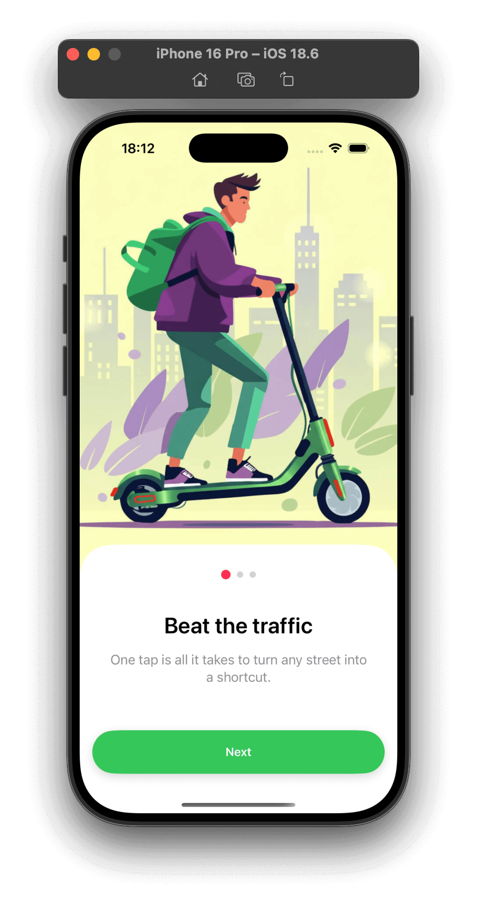 | 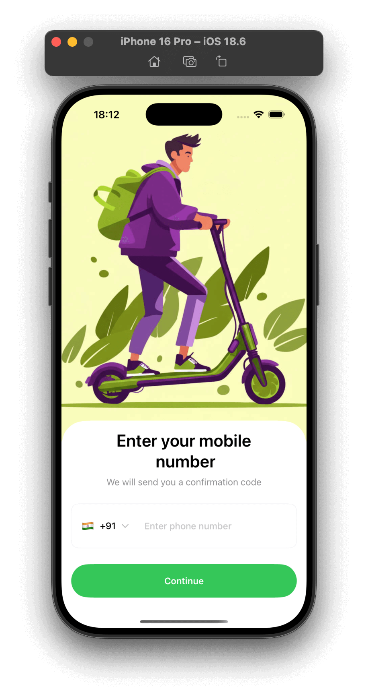 | 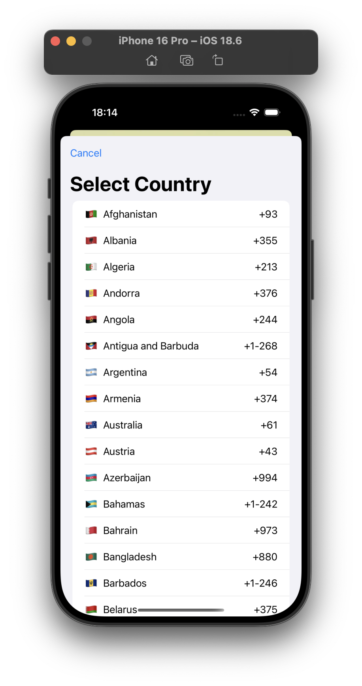 | 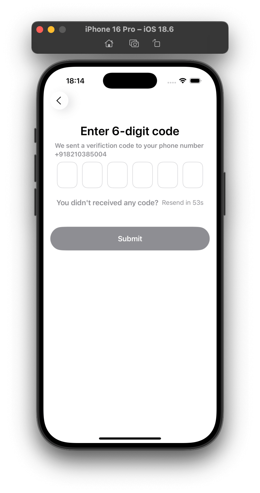 |


| User Name | DOB | Gender |   Success      |
|-------|------|---------|---------|
| 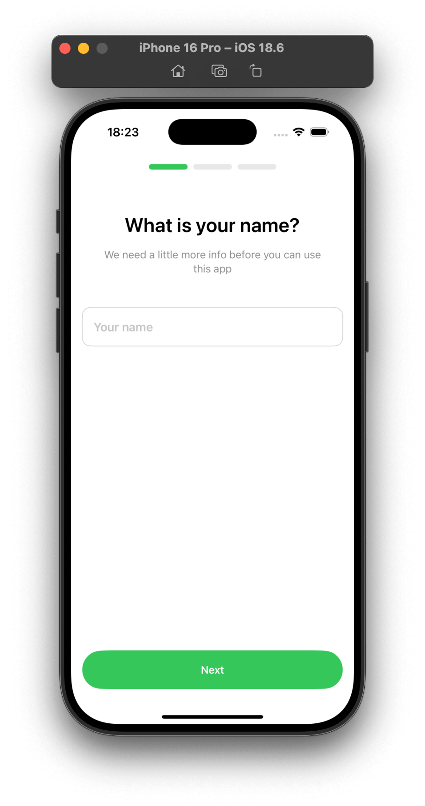 | 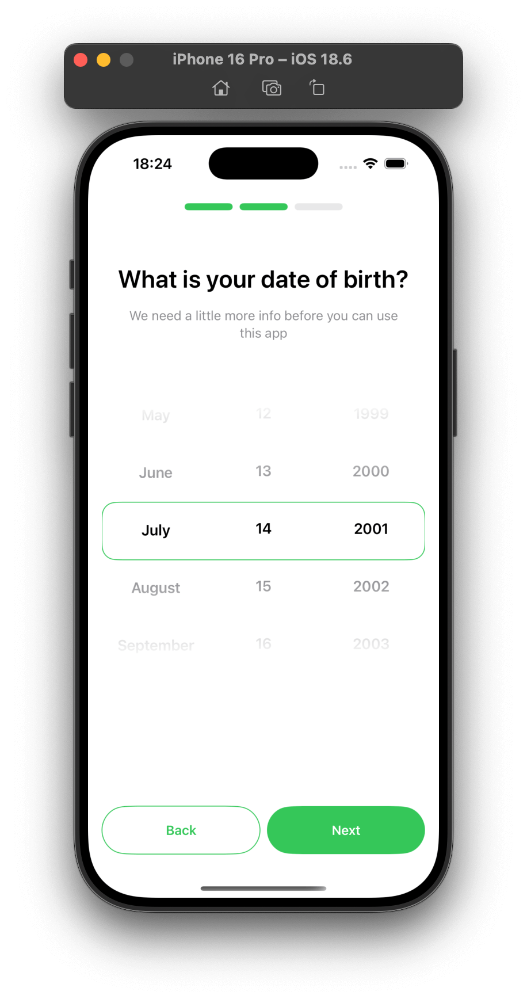 | 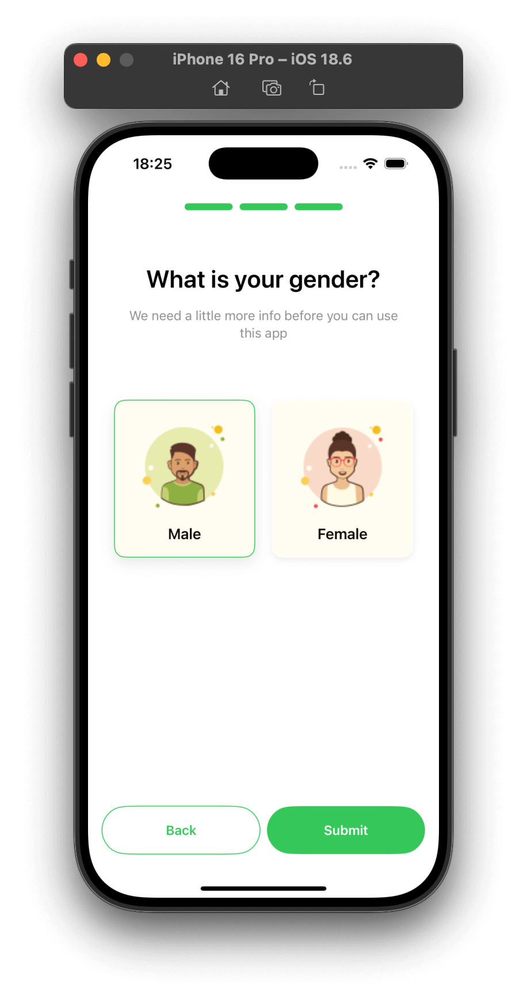 | 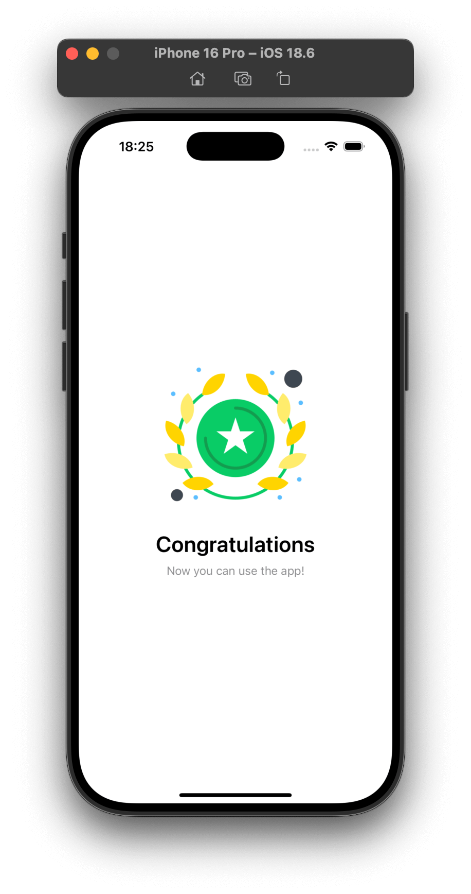 |

| Maps Permission | Home | Scooter Detail |   QR Code Sacan     |
|-------|------|---------|---------|
| 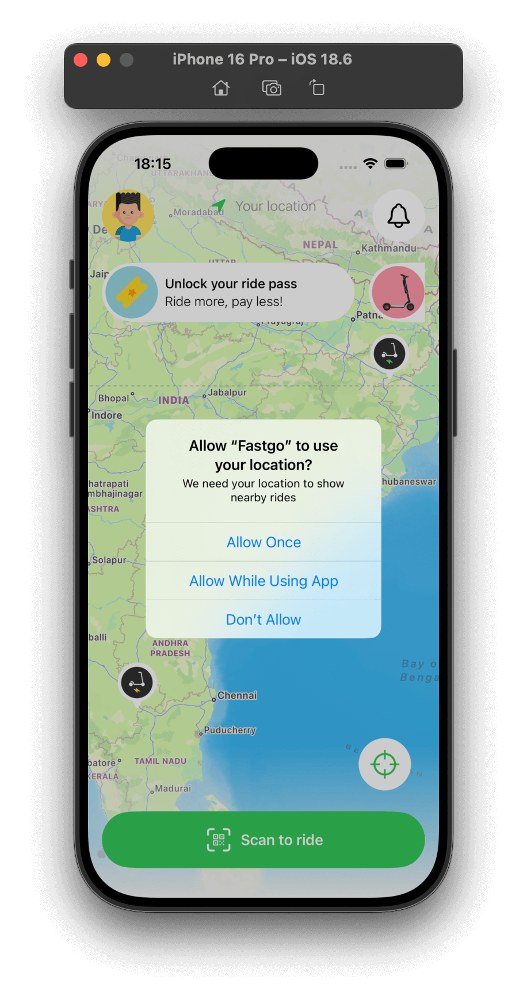 |  | 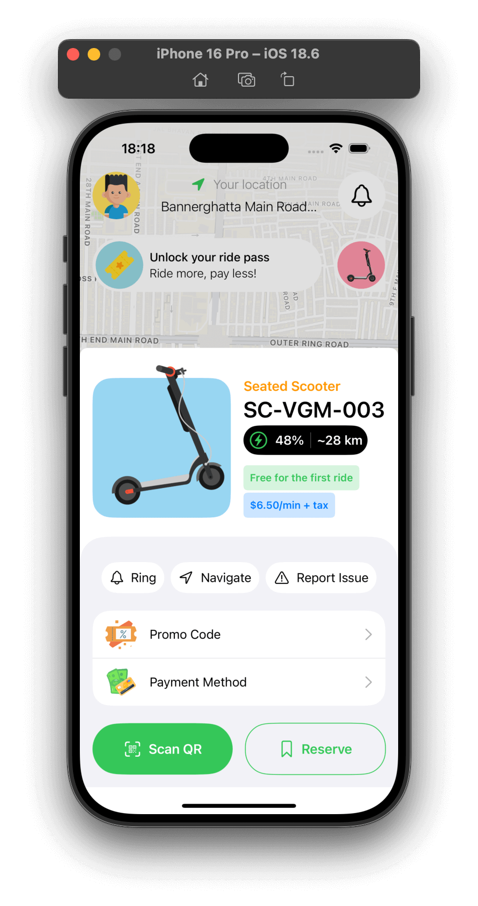 | 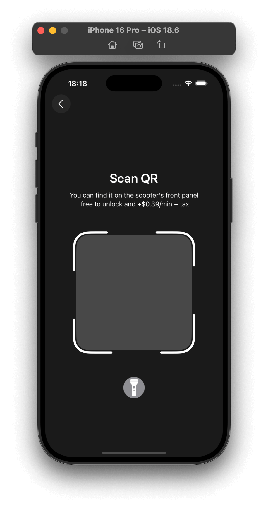 |


| Settings | Profile | Ride History |   Promo Codes    |
|-------|------|---------|---------|
| 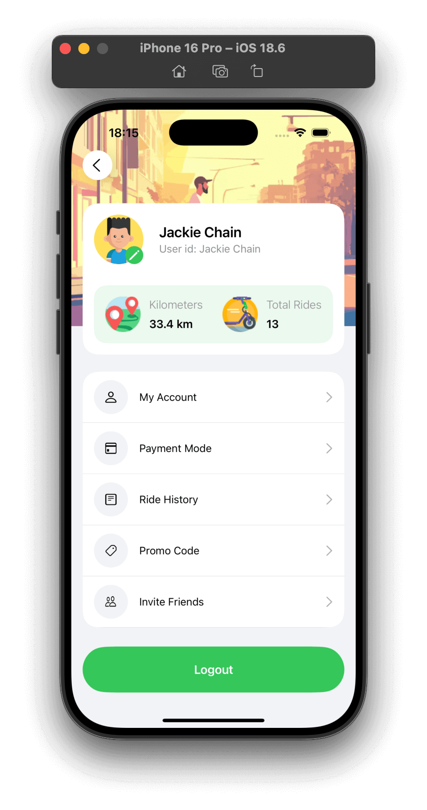 | 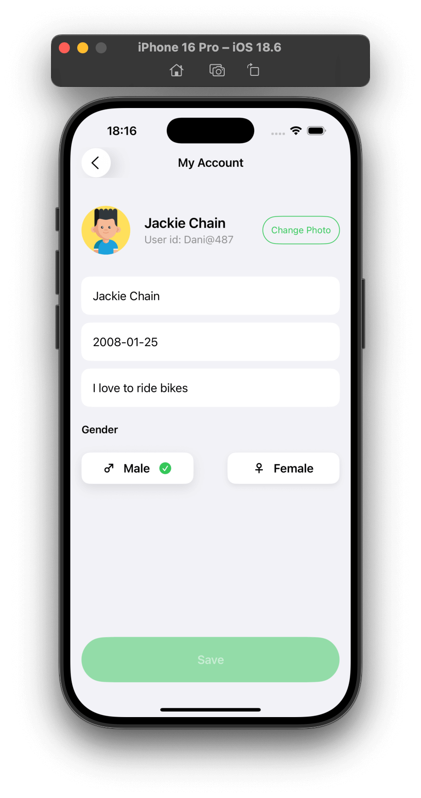 | 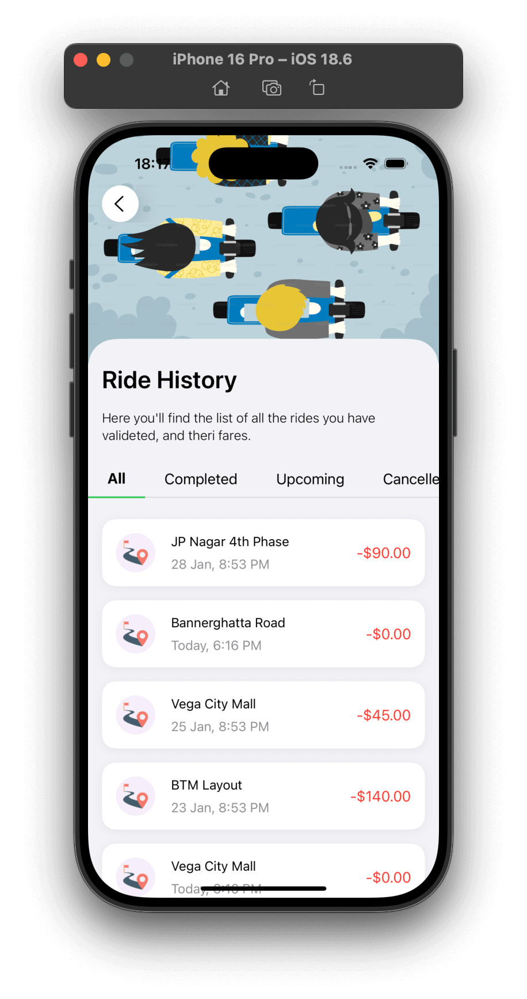 |  |


| Navigate to Scooter | Reserve Scooter | Ride In Progress |   Nearby Parking    |
|-------|------|---------|---------|
| 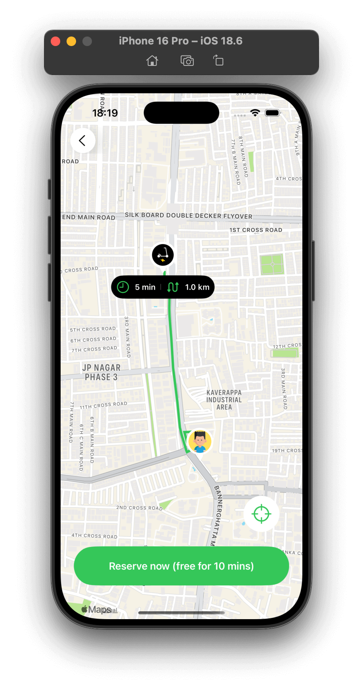 | 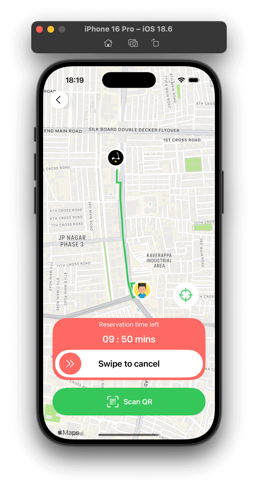 | 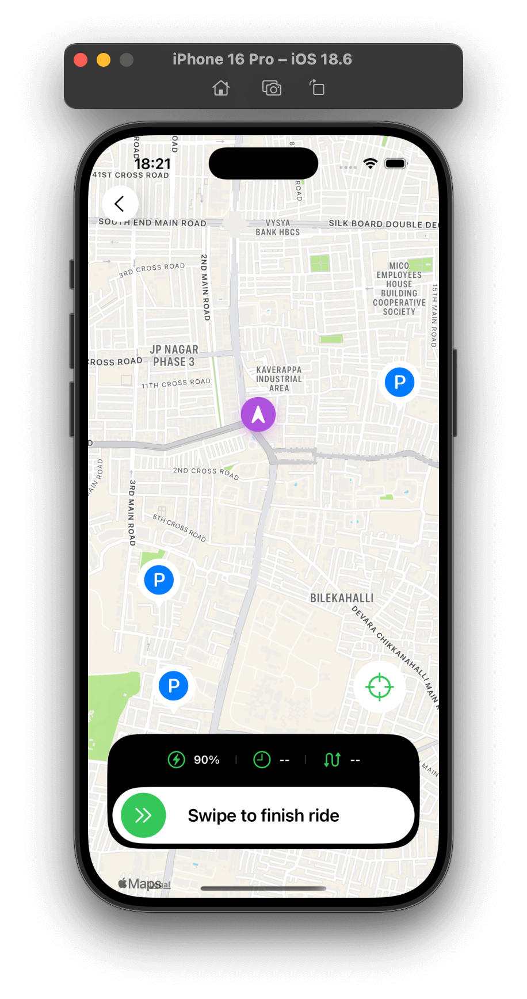 | 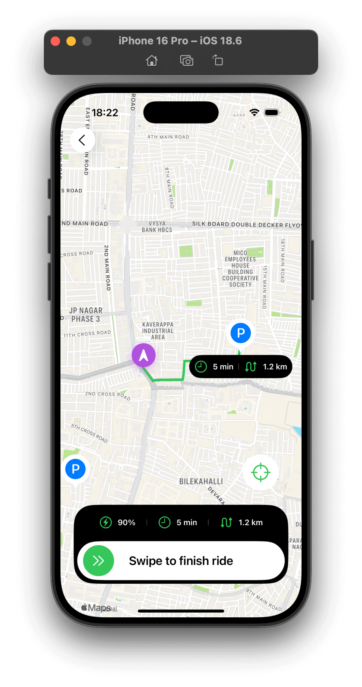 |


| Finish Ride |
|-------|
| 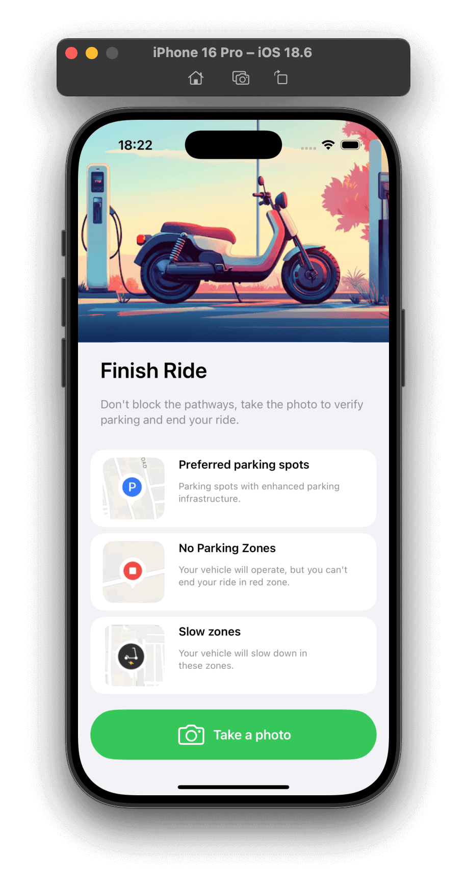 |
