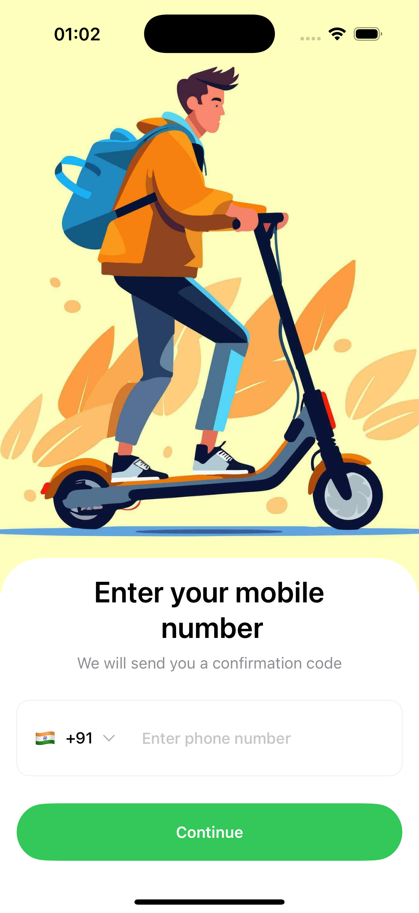
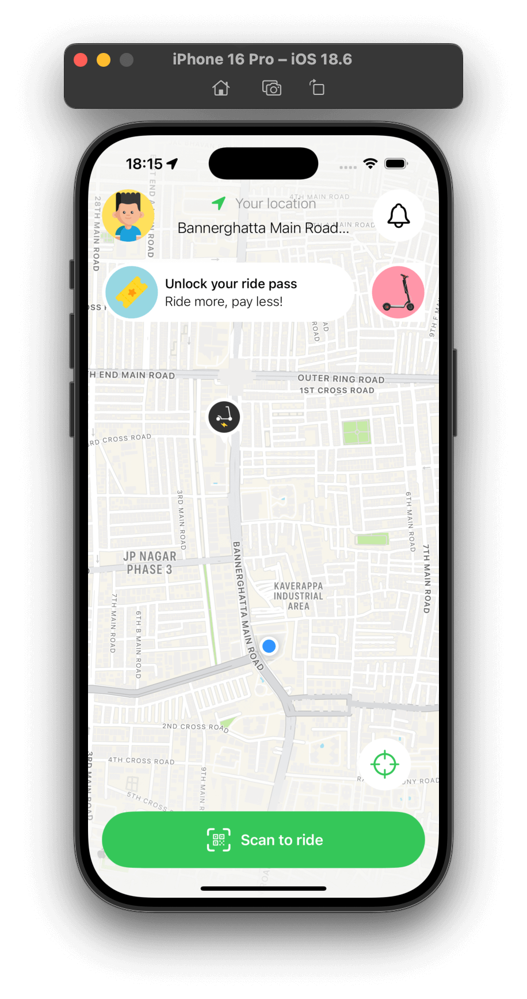
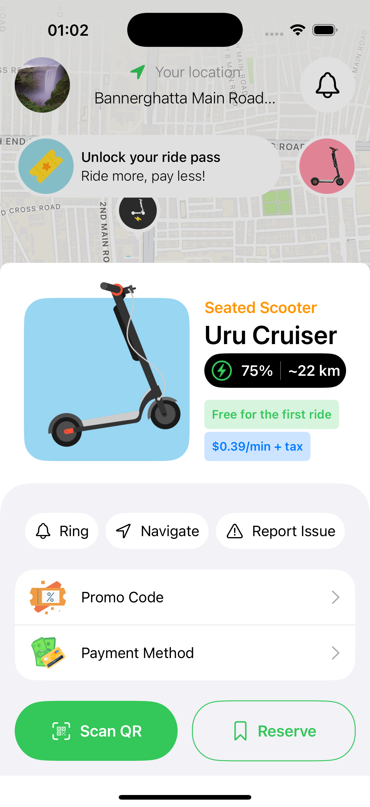

# Fastgo Scooty - iOS Mobile App 🛴

**Fastgo Scooty** is a modern, eco-friendly electric scooter rental application built with **SwiftUI** and powered by **Supabase**. This project implements the UI/UX design concept by [Orbix Studio on Behance](https://www.behance.net/gallery/186219777/Fastgo-Scooty-UI-UX-Mobile-App-Orbix-Studio), focusing on a seamless user experience for urban mobility.

## 📱 Features

Based on the Fastgo Scooty design specifications, the app includes:

* **Onboarding**: Clean, flat-style onboarding flow introducing the eco-friendly mission.
* **Home & Map View**: Real-time map interface showing nearby scooters with battery levels and status.
* **QR Scanner**: Integrated camera functionality to scan scooter QR codes for unlocking.
* **Ride Dashboard**: Live ride tracking with timer, distance, and current cost.
* **Wallet & Payments**: Digital wallet integration to top-up balance and pay for rides.
* **Ride History**: Detailed summary of past trips, including route maps and receipt breakdown.
* **Profile Management**: User settings, notification preferences, and account management.

## 🛠 Tech Stack

* **Language**: Swift 5+
* **Framework**: SwiftUI
* **Architecture**: MVVM (Model-View-ViewModel)
* **Backend**: Supabase (PostgreSQL, Auth, Realtime)
* **Maps**: MapKit / CoreLocation
* **Hardware Integration**: AVFoundation (QR Scanning)

## 🚀 Getting Started

### Prerequisites

* **Xcode**: Version 15.0 or later
* **iOS**: Target iOS 17.0+
* **Supabase Account**: A generic project created on [supabase.com](https://supabase.com/)

### Installation

1.  **Clone the repository**
    ```bash
    git clone https://github.com/vishwas-kr/Fastgo.git
    cd fastgo
    ```

2.  **Open in Xcode**
    Open `FastgoScooty.xcodeproj` in Xcode.

3.  **Configure Environment Variables**
    Create a file named `Secrets.plist` (or use a `.xcconfig` file) in your project root to store your API keys. **Do not commit this file.**
    
    ```xml
    <?xml version="1.0" encoding="UTF-8"?>
    <!DOCTYPE plist PUBLIC "-//Apple//DTD PLIST 1.0//EN" "[http://www.apple.com/DTDs/PropertyList-1.0.dtd](http://www.apple.com/DTDs/PropertyList-1.0.dtd)">
    <plist version="1.0">
    <dict>
        <key>SupabaseURL</key>
        <string>YOUR_SUPABASE_PROJECT_URL</string>
        <key>SupabaseAnonKey</key>
        <string>YOUR_SUPABASE_ANON_KEY</string>
    </dict>
    </plist>
    ```
## Supabase Database Setup
Run this SQL in the Supabase SQL Editor:

```
CREATE TABLE users (
    id UUID PRIMARY KEY REFERENCES auth.users(id) ON DELETE CASCADE,
    phone VARCHAR(20) UNIQUE NOT NULL,
    name VARCHAR(100),
    gender VARCHAR(20),
    about_me VARCHAR(100),
    date_of_birth DATE,
    profile_image TEXT,
    total_rides INTEGER NOT NULL DEFAULT 0,
    total_distance DECIMAL(10,2) NOT NULL DEFAULT 0.0,
    user_status JSONB NOT NULL DEFAULT '{"basic_info_completed": false}'::jsonb,
    created_at TIMESTAMP WITH TIME ZONE NOT NULL DEFAULT NOW(),
    updated_at TIMESTAMP WITH TIME ZONE NOT NULL DEFAULT NOW()
);

ALTER TABLE users ENABLE ROW LEVEL SECURITY;

CREATE POLICY "Users can read their own profile"
ON users
FOR SELECT
USING (auth.uid() = id);

CREATE POLICY "Users can insert their own profile"
ON users
FOR INSERT
WITH CHECK (auth.uid() = id);

CREATE POLICY "Users can update their own profile"
ON users
FOR UPDATE
USING (auth.uid() = id)
WITH CHECK (auth.uid() = id);

CREATE POLICY "Users can delete their own profile"
ON users
FOR DELETE
USING (auth.uid() = id);
```

 ### App Screenshots
<p align="left">
  
  
  
  
</p>
